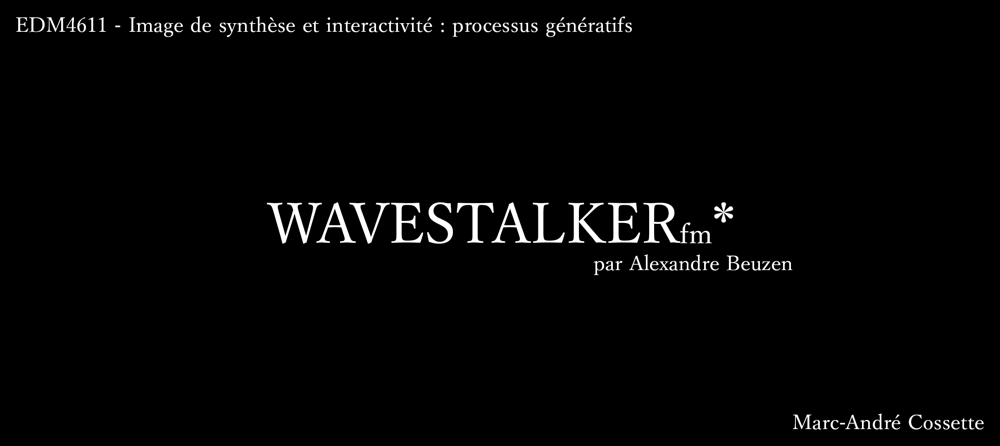
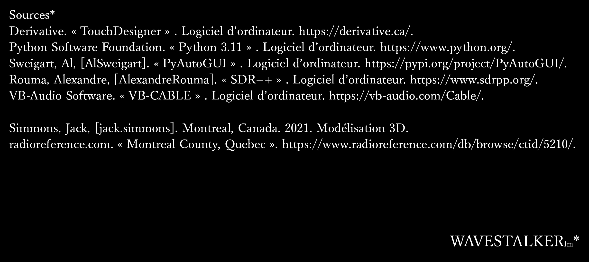

Dépendances : 

/mac : Pour que le .toe fonctionne, il faut pouvoir importer les librairies : pyautogui et time
Il est possible de remplacer l'input audio sur le mac par un fichier audio, afin de simuler de l'audio réactivité

/pc : Normalement, tout les fichiers chargeront automatiquement, il est possible que la carte ne charge pas du premier coup, un bouton reboot recharge la carte dans le container du projet.

